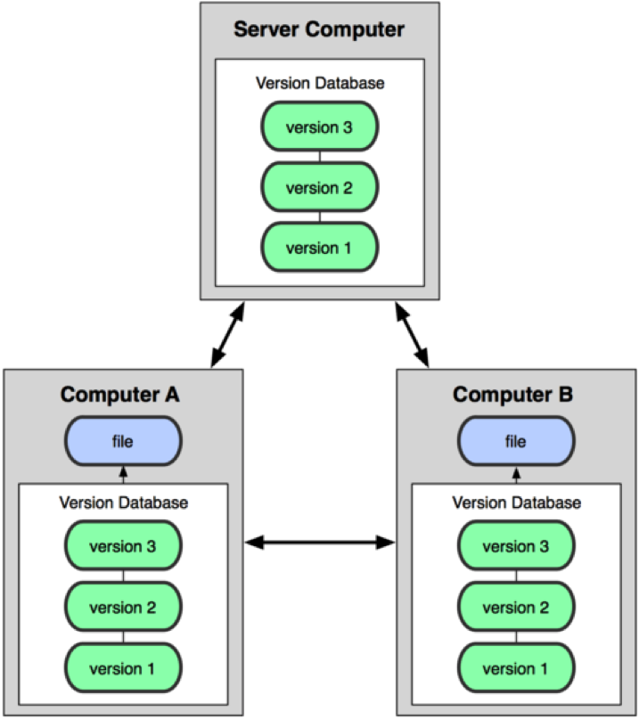
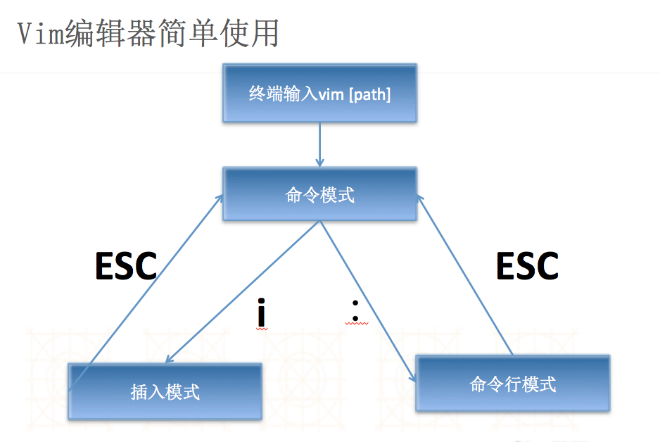

# 源代码管理工具-GIT

----
----

## 一. git 概述
### 1. git 简介?
1. 什么是git?

		> git是一款开源的分布式版本控制工具
		> 在世界上所有的分布式版本控制工具中，git是最快、最简单、最流行的

2. git的起源?

		> 作者是Linux之父：Linus Benedict Torvalds
		> 当初开发git仅仅是为了辅助Linux内核的开发（管理源代码）

3. git的现状?

		> 在国外已经非常普及，国内并未普及（在慢慢普及）
		> 越来越多的开源项目已经转移到git

### 2. 常见的源代码管理工具有哪些?
	
	> CVS
	 	- 开启版本控制之门
		- 1990年诞生，“远古时代”的主流源代码管理工具
		
	> SVN
		- 全称是Subversion，集中式版本控制之王者
		- 是CVS的接班人，速度比CVS快，功能比CVS多且强大
		- 在国内软件企业中使用最为普遍（70%-90%）
		
	> ClearCase
		- 收费的集中式版本控制工具，安装比Windows还大，运行比蜗牛还慢
		- 能用ClearCase的一般是世界500强，他们有个共同的特点是财大气粗或者人傻钱多
		
	> VSS
		- 微软的集中式版本控制工具，集成在Visual Studio中
		
### 3. 集中式版本控制
**所有的代码都集中在一块, 统一进行管理**

### 4. 分布式版本控制
**在每个客户端都有一份完整的代码仓库, 可以在每个客户端自行管理**

### 5. git 和 svn的简单对比
	> 速度
		在很多情况下，git的速度远远比SVN快
	> 结构
		SVN是集中式管理，git是分布式管理
	> 其他
		SVN使用分支比较笨拙，git可以轻松拥有无限个分支
		SVN必须联网才能正常工作，git支持本地版本控制工作
		旧版本的SVN会在每一个目录置放一个.svn，git只会在根目录拥有一个.git

### 6. SVN工作流程和GIT工作流程对比
	- svn checkout —— git clone
		svn 只下载代码， git 会连同代码仓库一起下载下来

	- svn commit —— git commit
		svn 是提交到服务器，git 中是提交到本地仓库，需要使用push才能提交到服务器
	
	-  svn update - git pull
		都是从服务器下载最新被修改的代码

**分布式和集中式最大的区别在于：在分布式下，本地有个代码仓库,开发者可以在本地提交; 而集中式版本控制, 只有在服务器才有一个代码仓库, 只能在服务器进行统一管理**

### 7. git工作原理
1. 概念理解
		
		- 工作区
			> 与.git文件夹同级的其他文件夹或者子文件夹
			
		- 版本控制库
			> 暂缓区
			> 分支(Git不像SVN那样有主干和分支的概念. 仅仅存在分支,其中master分支为默认被创建的分支,类似于SVN中的主干)
				切换分支:通过控制HEAD指针指向不同的分支,就可以切换*
		
** 操作原则: 所有新添加/删除/修改的文件 必须先添加到暂缓区,然后才能提交到HEAD指向的当前分支中**

### 8. git使用环境
1. 单人开发只需要一个本地库
	
		原因:不需要与他人共享代码,只负责管理自己代码即可;例如提交代码,删除代码,版本控制等等

2. 多人开发时需要一个共享版本库

		共享版本库的形式:
			本地共享库:文件夹/U盘/硬盘
			远程共享库:自己搭建git服务器/ 托管到第三方平台(例如github, oschina)
			
3. 使用环境
** 无论是单人开发还是多人开发,客户端都可以使用命令行或者图形界面使用git**

		> SourceTree
			- 下载地址：http://www.sourcetreeapp.com/download/
		> GitHub
			- 下载地址：https://mac.github.com
			- 不过它是专门为GitHub网站而设计的
		> Xcode
			- 虽然集成较好,但是只能做一些常用的简单操作,复杂操作还要使用命令行

----

## 二. Git命令行演练-个人开发
### 0. 如何学习git指令

		> git help [子命令]
		> 和学习SVN指令是一样的，只不过git是通过使用指南的形式展示给用户看（不能编辑的vim编辑器），使用q退出vim编辑器，按空格进入下一页，ctrl + B 回到上一页； /关键字 进行搜索

### 1. 初始化一个本地仓库
		> 原因: 管理本地代码,修改上传,版本回退
		> 命令: git init

### 2. 配置仓库
		> 告诉git你是谁？
			原因: 追踪修改记录
			命令: git config user.name “shunzi”
			
		> 告诉git怎样联系你？
			原因: 多人合作开发时, 沟通交流
			命令: git config user.email "shunzi@qq.com"
			
		> 查看配置信息（.git -> config打开）
			命令:  git config -l
	
### 3. 个人开发演练
	
		> 创建文件并提交
			命令: 
				touch main.c
				git add . 
				git commit -m “注释”
		> 修改文件并提交 
			命令: 
				git add .
				git commit -m “注释”
		> 删除文件并提交
			命令: 
				git rm person.h
				git commit -m “注释”
		> 日志查看
			命令: 
				git log 
				git reflog
		> 版本回退
			命令: 
				git reset —hard HEAD 重置到当前版本
				git reset —hard HEAD^^ 重置到上上个版本
				git reset ——hard HEAD2 重置到往上2个版本
				git reset —hard 七位版本号 重置到指定版本::

### 5. 备注补充
1. 文件状态(git status)
		
		> 颜色含义
			红色: 代表被添加或者修改的文件没有被添加到暂缓区
			绿色: 代表文件在暂缓区,等待提交
		> 版本号的含义
			版本号是一个由SHA1生成的40位哈希值
			这样做的目的是保证版本号的唯一
			
2. vim编辑器的使用

		命令模式:等待编辑命令输入;所有输入的内容都被当做命令来执行
		插入模式:输入的所有内容都被显示,并被当做文件内容处理
		命令行模式:执行待定命令(保存文件并退出vim : wq   ; 强制退出不保存: q! )

3. 日志查看配置

		命令如下: 
			git config --global alias.lg "log --color --graph --pretty=format:'%Cred%h%Creset -%C(yellow)%d%Creset %s %Cgreen(%cr) %C(bold blue)\<%an\>%Creset' --abbrev-commit"

4. 配置别名
	
		git config alias.st “status”
		git config alias.ci “commit -m”
		
5. --global的作用
	
		可以进行全局配置,所有的版本库共享此配置
		查看全局配置（桌面前往->个人->.gitconfig
		** 个人电脑上建议使用全局配置**

## 三. Git命令行演练-团队开发
** 团队开发必须有一个共享库,这样成员之间才可以进行协作开发**

### 0. 共享库分类

		> 本地共享库(只能在本地面对面操作)
			- 电脑文件夹/U盘/移动硬盘
			
		> 远程共享库(可通过网络远程操作)
			- 自己搭建Git服务器(**不建议**)
			- 在Github上托管项目(** 建议**)
				Github网址(https://github.com); 公开项目免费, 私有项目收费
			- 在OSChina上托管项目(** 推荐**)
				OSChina网址(https://git.oschina.net) 安全免费,在国内访问速度快

### 1. 搭建本地共享库

		原因: 多人合作开发,代码共享
		命令: git init —-bare

### 2. 经理初始化项目到本地共享库

		命令: git clone 本地代码仓库地址
	
### 3. 演示多人开发
	
		> 创建文件夹manager, niuda
			命令:
				mkdir manager 
				mkdir niuda
		> 分别进入到两个文件夹从共享库clone项目到本地
			命令:
				git clone 本地代码仓库地址
				git clone 本地代码仓库地址
		> 演练新增文件同步
			命令:
				touch person.h
				git add .     
				git commit -m “创建person.h”
				git push    
				git pull
		> 演练修改文件同步
			命令:
				git add . 
				git commit -m “注释”
				git push
				git pull
		> 演练删除文件同步
			命令:
				git rm filename
				git commit -m “注释”
				git push       
				git pull
		> 演练冲突解决
			命令:
				git pull
	
		> 演练忽略文件
			命令:
				touch .gitignore   
				open .gitignore   加入忽略文件名
				git add .     
				git commit -m “注释”
			.gitignore文件配置规则
				http://www.cnblogs.com/haiq/archive/2012/12/26/2833746.html
				
### 4. 备注笔记

		> 关于忽略文件
		 	在真实开发中,配置.gitignore文件 ， 去github里面搜索gitignore 选择OC版本的，拷贝到本地仓库即可,记得添加到本地版本库
		
		> 常见问题
			fetch first 代表当前文件过期,需要从远程共享库更新 
			git pull

----

## 四. Git-XCode演练-团队开发
### 1. 搭建本地共享版本库

	命令: git init —-bare
	
### 2. 经理初始化项目到共享版本库

	** 注意: 添加忽略文件, 不然Xcode有可能会把没必要的文件提交**
	** 必须在使用Xcode之前把忽略文件添加进来, 因为Xcode创建工程时, 默认直接把所有文件添加到暂缓区, 加进去之后忽略文件对其就无效了**
	
### 3. 牛大,牛二使用Xcode 克隆项目
### 4. 演练添加文件同步
### 5. 演练修改文件同步
### 6. 演练删除文件同步
### 7. 演练冲突

## 五. github的使用
### 1. 托管项目到github
1. 打开github网站:[https://www.github.com]
2. 注册账号(OneShunzi)
3. 点击创建新仓库[https://github.com/new]
4. 填入项目名称,描述等信息
5. 创建完成
6. 可根据生成的版本库地址进行克隆下来进行操作

	
### 2. 怎样加入合作伙伴
1. 点击”个人” -> setting -> SSH keys -> Add SSH key
2. 将你小伙伴生成的公钥添加进来即可.(以下是生成公钥私钥方法)
	[https://help.github.com/articles/generating-ssh-keys/]

	
### 3. 怎样将其他著名框架添加到我们的代码仓库?
1. 搜索到对应的框架
2. 点击fork
3. 当项目被移到自己代码仓库中,就可以根据地址克隆下来进行操作

		** 注意:
			你可以针对此框架进行任意修改,但是仅仅作用在你的本地仓库中的副本,对原作者项目没有任何影响. 
			如果想向原作者提建议,可以直接使用,pull request操作.
			提交完成后,原作者可以在pull request中看到你的提交.至于是否采纳,就是原作者的意愿

----

## 六. OSChina的使用
### 1. 托管项目到OSChina

1. 打开oschina网站:[https://git.oschina.net]
2. 注册账号(OneShunzi)
3. 点击创建新仓库[https://git.oschina.net/projects/new]
4. 填入项目名称,描述等信息
5. 创建完成
6. 可根据生成的版本库地址进行克隆下来进行操作

### 2. 怎样加入合作伙伴?

1. 点击”管理”-\>项目成员管理-\>选择成员权限进行创建
2. 或者直接只用SSH(以下是生成公钥私钥方法)
			
			> 部署公钥允许以只读的方式访问项目，主要用于项目在生产服务器的部署上，免去HTTP方式每次操作都要输入密码和普通SSH方式担心不小心修改项目代码的麻烦。
			> [https://help.github.com/articles/generating-ssh-keys/]

### 3. 怎样将其他著名框架添加到我们的代码仓库?

1. 搜索到对应的框架
2. 点击fork
3. 当项目被移到自己代码仓库中,就可以根据地址克隆下来进行操作

		** 注意:
			你可以针对此框架进行任意修改,但是仅仅作用在你的本地仓库中的副本,对原作者项目没有任何影响. 
			如果想向原作者提建议,可以直接使用,pull request操作.
			提交完成后,原作者可以在pull request中看到你的提交.至于是否采纳,就是原作者的意愿
		
				
----

## 七. 新人服务器搭建(补充了解)
0. 新人服务器搭建概念原因?
	
		概念: 搭建一个临时共享版本库, 供新人专用
		原因: 防止新人刚到时，搞乱服务器上的项目
		
1. 新建一个文件夹，newBee，作为新人服务器
2. 进入文件夹 使用git init —-bare 初始化仓库
3. 经理打开自己项目所在文件夹，执行PULL ,更新到最新
4. 然后source control ->项目master -> configure 项目
	
		> 选择Remotes 选项 代表当前所连的远程服务器地址
		> 点击+号 添加 将newBee文件路径作为另外一个远程服务器地址 file:// 协议开头 结尾以/结尾
		> Done
		
5. 经理将最新代码提交到新人远程仓库
6. 经理分配新人服务器地址给新人
7. 新人各种折腾
8. 经理建立文件夹，从新人服务器下载代码检查
9. 图解

	

----

## 八. Git版本备份/分支管理(补充了解)

** 在git中不是通过拷贝代码来解决备份和开启分支的**
** git 直接打标签， 通过控制head指向，来回到任一版本**

### 1.版本备份
1. 建立共享库

		> 创建文件夹shareWeibo
		> 进入文件夹后,初始化共享库
			git init ——bare
2. 经理克隆项目后开发完1.0版本,打标签后,上传共享库
	
		> 创建manager文件夹
		> 进入文件夹后
			git clone 共享库绝对路径
		> 进入工作区,配置姓名,邮箱
			git config user.name “manager”
			git config user.email “manager@qq.com”
		> 经理创建文件,并修改部分代码,提交代码,上传到共享库,完成v1.0版本
			touch main.c
			open main.c:: 打开后写入abc
			git add .
			git commit -m “完成1.0版本开发”
			git push
		> 经理给此版本打标签,并将标签上传到共享库
			git tag -a v1.0 -m “标记1.0版本”
			git push origin v1.0
		> 经理继续开发2.0版本......并提交
			git add .
			git commit -m “2.0部分功能”
			git push

### 2. 已发布版本bug修复
 
 **在以上步骤基础上做以下操作**
 
1. 牛大克隆项目,根据1.0版本创建分支,修复bug
	
		> 创建niuda文件夹
		> 进入文件夹后
			git clone 共享库绝对路径
		> 进入工作区,配置姓名,邮箱
			git config user.name “niuda”
			git config user.email “niuda@qq.com”
		> 根据v1.0版本建立新分支v1.0fixbug并切换到此分支
			git checkout v1.0 -b v1.0fixbug::
		> 修复bug后提交到本地版本库
		
	** 注意此处提交到的是HEAD指向的分支-v1.0fixbug**
		
			git add .
			git commit -m “修复bug”
			
2. 牛大修复bug后,打标签v1.1作版本备份,并上传共享库
	
		git tag -a v1.1 -m “1.1版本备份”
		git push origin v1.1
		
3. 牛大上传整个分支到共享版本库
		
		git push origin v1.0fixbug

** ———至此,分支修复bug结束,下面经理要合并分支———**

4. 经理从共享库更新代码到本地库
		
		git pull
		
5. 经理查看当前服务器都有哪些分支

		git branch -r
		
6. 经理切换到master分支后,将v1.0fixbug分支合并过来

		git checkout master
		git merge origin/v1.0fixbug -m “合并分支”
		
7. 经理合并完成后提交到共享库
		
		git add .
		git commit -m “合并分支”
		git push
		
8. 合并完成后,可以删除共享库的分支

		git branch -r -d origin/v1.0fixbug
		
9. 查看版本标签,至此结束!!    
		
		git tag

